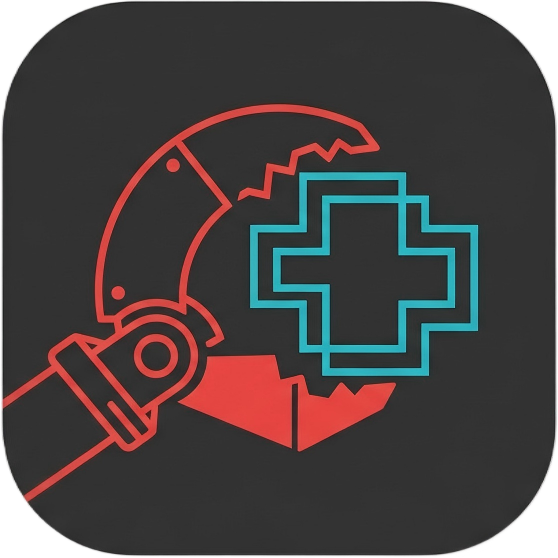

<p align="center">
  <a href="README_ZH.md"></a>
  <a href="README.md"></a>
</p>

***

<p align="center">
  
</p>

<h1 align="center">Claw++ — AI Agent Desktop Application</h1>

<p align="center">
  <a href="https://github.com/DavidLi-TJ/ClawPP-Agent/stargazers">
    
  </a>
  <a href="https://github.com/DavidLi-TJ/ClawPP-Agent/network/members">
    
  </a>
  <a href="https://github.com/DavidLi-TJ/ClawPP-Agent/issues">
    
  </a>
  <a href="https://github.com/DavidLi-TJ/ClawPP-Agent/blob/main/LICENSE">
    
  </a>
  <a href="https://github.com/DavidLi-TJ/ClawPP-Agent">
    
  </a>
</p>

<p align="center">
  
  
  
  
</p>

<p align="center">
  
  
</p>

***

## 📖 Table of Contents

- [📖 Table of Contents](#-table-of-contents)
- [Introduction](#introduction)
  - [✨ Why Claw++?](#-why-claw)
  - [🌐 Supported Model Providers](#-supported-model-providers)
- [🚀 Features](#-features)
- [🏗️ Architecture](#️-architecture)
- [🛠️ Tech Stack](#️-tech-stack)
- [📸 Screenshots](#-screenshots)
- [📦 Installation](#-installation)
  - [📥 Download Installer (Recommended)](#-download-installer-recommended)
  - [🔄 Build Installer with IFW](#-build-installer-with-ifw)
  - [🔨 Build from Source](#-build-from-source)
    - [📋 Requirements](#-requirements)
    - [🔨 Build Steps](#-build-steps)
    - [🏗️ Build Installer](#️-build-installer)
  - [▶️ Run](#️-run)
- [📁 Project Structure](#-project-structure)
- [🔧 Development Guide](#-development-guide)
  - [Add a New Tool](#add-a-new-tool)
  - [Add a New Provider](#add-a-new-provider)
  - [Debugging Tips](#debugging-tips)
- [🎓 About the Project](#-about-the-project)
- [📊 Project Stats](#-project-stats)
- [📜 License](#-license)
- [💡 Acknowledgments](#-acknowledgments)

***

## Introduction

> **Claw++** is a modern AI Agent desktop application built with Qt/C++ for the Windows platform. It implements a complete ReAct (Reasoning + Acting) loop, supports **23 LLM service providers** (covering OpenAI, Anthropic, Gemini, DeepSeek, Zhipu and other mainstream platforms), and provides rich tool calling capabilities with intelligent memory management. Built with Qt Quick 6, it features a stunning Windows 11 glass morphism UI with real-time streaming chat, session management, context compression, and a skill plugin system.

- 🤖 **ReAct Engine**: Think-Act-Observe loop with multi-turn autonomous reasoning and tool calling
- 🔧 **9 Built-in Tools**: file read/write, shell commands, network requests, subagents, search, and more
- 💬 **Real-time Streaming Chat**: SSE-based responses with Markdown rendering and code highlighting
- 🔐 **3-Level Permission System**: Safe / Moderate / Dangerous with Shell risk scoring (1-4 levels)
- 🧠 **4-Stage Memory Compression**: Trim → Dedupe → Fold → Summarize progressive compression pipeline
- 🎯 **Skill Plugin System**: Markdown skill definitions with YAML metadata, hot-reload at runtime
- **Win11 Glass Morphism UI**: Frosted panels, liquid buttons, ripple effects, smooth animations
- 🎨 **Ultimate UI Customization**: Custom background images, adjustable frosted glass blur, line spacing, corner radii, and shadow depth — your interface, your rules
- 🪶 **Feather-Light**: Native C++ compilation — installer under 100MB, minimal memory footprint. Say goodbye to bloated Electron apps
- 🌐 **23 LLM Providers**: Comprehensive coverage of domestic and international platforms
- 💾 **SQLite Persistence**: Full session, message, and memory storage with import/export support

### ✨ Why Claw++?

> Tired of AI chat apps that hog hundreds of MBs and eat all your RAM? Claw++ is compiled in native C++, ships in under 100MB, and runs buttery smooth.
>
> Sick of cookie-cutter interfaces? Claw++ puts you in the driver's seat. Swap in your own background image, dial the frosted glass blur to your liking, nudge the line spacing, even tweak corner radii and shadow depth. Every detail bends to your taste.
>
> Beauty meets performance. Windows 11 glass morphism aesthetics, liquid buttons, and ripple effects — gorgeous without bogging down your machine.

### 🌐 Supported Model Providers

| Category | Provider |
|----------|----------|
| **Global** | OpenAI |
| <br />   | Anthropic |
| <br />   | Google Gemini |
| <br />   | Mistral AI |
| <br />   | Groq |
| <br />   | OpenRouter |
| <br />   | GitHub Copilot |
| <br />   | Azure OpenAI |
| <br />   | OpenAI Codex |
| **China** | DeepSeek |
| <br />   | Zhipu AI |
| <br />   | Z.ai |
| <br />   | Moonshot AI |
| <br />   | DashScope |
| <br />   | SiliconFlow |
| <br />   | StepFun |
| <br />   | MiniMax |
| <br />   | Volcengine |
| <br />   | BytePlus |
| <br />   | AI Hub Mix |
| **Local** | Ollama |
| <br />   | OpenVINO |
| <br />   | vLLM |

***

## 🚀 Features

<div align="center">
  <table>
    <tr>
      <td align="center"><b>🤖 ReAct Engine</b><br/>Autonomous reasoning with Think-Act-Observe loop</td>
      <td align="center"><b>🔧 Tool Calling System</b><br/>File system, Shell, network requests, and more</td>
    </tr>
    <tr>
      <td align="center"><b>💬 Streaming Chat UI</b><br/>Real-time responses with fluent chat experience</td>
      <td align="center"><b>🔐 Permission Management</b><br/>3-level permissions (Safe/Moderate/Dangerous), secure execution</td>
    </tr>
    <tr>
      <td align="center"><b>🧠 Smart Memory</b><br/>Auto-compressed conversation history with long-term memory</td>
      <td align="center"><b>🎯 Skill System</b><br/>Extensible skill plugin mechanism</td>
    </tr>
  </table>
</div>

***

## 🏗️ Architecture

```
┌─────────────────────────────────────────────────────────┐
│                      UI Layer                           │
│  ┌─────────────┐  ┌─────────────┐  ┌─────────────┐    │
│  │ MainWindow  │  │  ChatView   │  │SessionPanel │    │
│  └─────────────┘  └─────────────┘  └─────────────┘    │
└─────────────────────────────────────────────────────────┘
                            ↓
┌─────────────────────────────────────────────────────────┐
│                  Application Layer                      │
│  ┌─────────────┐  ┌─────────────┐  ┌─────────────┐    │
│  │AgentService │  │SessionManager│ │TemplateLoader│    │
│  └─────────────┘  └─────────────┘  └─────────────┘    │
└─────────────────────────────────────────────────────────┘
                            ↓
┌─────────────────────────────────────────────────────────┐
│                    Agent Core Layer                     │
│  ┌─────────────┐  ┌─────────────┐  ┌─────────────┐    │
│  │IAgentCore   │  │ReactAgentCore│ │ContextBuilder│   │
│  └─────────────┘  └─────────────┘  └─────────────┘    │
└─────────────────────────────────────────────────────────┘
                            ↓
┌─────────────────────────────────────────────────────────┐
│                   Infrastructure Layer                  │
│  ┌──────────┐ ┌──────────┐ ┌──────────┐ ┌──────────┐  │
│  │ Provider │ │  Memory  │ │   Tool   │ │Permission│  │
│  └──────────┘ └──────────┘ └──────────┘ └──────────┘  │
│  ┌──────────┐ ┌──────────┐ ┌──────────┐ ┌──────────┐  │
│  │Database  │ │  Config  │ │  Logger  │ │  Event   │  │
│  └──────────┘ └──────────┘ └──────────┘ └──────────┘  │
└─────────────────────────────────────────────────────────┘
```

***

## 🛠️ Tech Stack

<p align="center">
  
</p>

<div align="center">
  
  
  
  
  
  
</div>

***

## 📸 Screenshots


<p align="center"><i>Claw++ Main Interface</i></p>


<p align="center"><i>Token Configuration Panel</i></p>

***

## 📦 Installation

### 📥 Download Installer (Recommended)

Get the latest Windows installer (.exe) from [GitHub Releases](https://github.com/DavidLi-TJ/ClawPP-Agent/releases). Double-click to install — zero config needed.

> 💡 Installer under 100MB, one-click install, ready to use out of the box
>
> 📦 Installer file: `ClawPP-Installer-v1.0.0.exe` (57.7 MB)

### 🔄 Build Installer with IFW

> Requires [Qt Installer Framework](https://doc.qt.io/qtinstallerframework/) to be installed first

```bash
# Run from project root
build_installer.bat
```

The script handles everything: Release build → gather files → IFW packaging → generates `ClawPP-Installer-v1.0.0.exe`.

### 🔨 Build from Source

#### 📋 Requirements

| Dependency | Version |
|------------|---------|
| Qt | 6.5+ |
| CMake | 3.20+ |
| C++ Compiler | MSVC 2019+ / GCC 8+ / Clang 9+ |

#### 🔨 Build Steps

```bash
# Clone the repository
git clone https://github.com/DavidLi-TJ/ClawPP-Agent.git
cd ClawPP-Agent

# Create build directory
mkdir build && cd build

# Configure the project
cmake ..

# Build the project
cmake --build . --config Release
```

#### 🏗️ Build Installer

> Requires [Qt Installer Framework](https://doc.qt.io/qtinstallerframework/) to be installed first

```bash
# Run from project root
build_installer.bat
```

The script handles everything: Release build → gather files → IFW packaging → generates `ClawPP-Installer-v1.0.0.exe`.

### ▶️ Run

```bash
# Windows
.\bin\ClawPP.exe

# Linux/Mac
./bin/ClawPP
```

***

## 📁 Project Structure

```
cpqclaw/
├── src/                          # Source code directory
│   ├── agent/                    # Agent core layer
│   │   ├── i_agent_core.h        # Agent interface definition
│   │   ├── react_agent_core.h    # ReAct mode implementation
│   │   └── context_builder.h     # Context builder
│   ├── application/              # Application layer
│   │   ├── agent_service.h       # Agent service
│   │   ├── session_manager.h     # Session management
│   │   └── session_thread.h      # Session thread
│   ├── common/                   # Common types and utilities
│   │   ├── types.h               # Core data structures
│   │   ├── constants.h           # Constant definitions
│   │   └── result.h              # Result template class
│   ├── infrastructure/           # Infrastructure layer
│   │   ├── config/               # Configuration management
│   │   ├── database/             # Database (SQLite)
│   │   ├── event/                # Event bus
│   │   ├── logging/              # Logging system
│   │   └── network/              # Network (HTTP, SSE)
│   ├── memory/                   # Memory system
│   ├── permission/               # Permission management
│   ├── provider/                 # LLM Providers
│   ├── skill/                    # Skill system
│   ├── tool/                     # Tool system
│   └── ui/                       # User interface
├── config/                       # Configuration files
├── qml/                          # QML UI files
├── resources/                    # Resource files
├── CMakeLists.txt                # CMake build configuration
└── README.md                     # Project documentation
```

***

## 🔧 Development Guide

### Add a New Tool

```cpp
class MyTool : public ITool {
    QString name() const override { return "my_tool"; }
    QString description() const override { return "My tool description"; }
    ToolResult execute(const QJsonObject& args) override {
        // Implementation logic
        return ToolResult::success("Result");
    }
};

// Register the tool
ToolRegistry::instance().registerTool(new MyTool());
```

### Add a New Provider

```cpp
class MyProvider : public ILLMProvider {
    QString name() const override { return "my-provider"; }
    void chatStream(...) override { /* Implement streaming call */ }
};

// Register the provider
ProviderManager::instance().registerProvider("my", new MyProvider());
```

### Debugging Tips

Use the logging system for debug output:

```cpp
LOG_INFO("Message content");
LOG_DEBUG("Debug information");
LOG_ERROR("Error information");
```

Log file location: `~/.clawpp/logs/app.log`

***

## 🎓 About the Project

This project was developed as a course assignment at **Nankai University (NKU)** by [DavidLi-TJ](https://github.com/DavidLi-TJ).

Built with the **Qt/C++** framework, it aims to explore practical application scenarios of AI Agents in desktop applications.

***

## 📊 Project Stats

<div align="center">
  <a href="https://github.com/DavidLi-TJ/ClawPP-Agent/stargazers">
    
  </a>
  <br/><br/>
  <a href="https://star-history.com/#DavidLi-TJ/ClawPP-Agent&Date">
    
  </a>
</div>

***

## 📜 License

This project is licensed under the MIT License - see the [LICENSE](LICENSE) file for details.

***

## 💡 Acknowledgments

- Nankai University course project support
- Pioneering work by the ReAct paper authors
- Excellent development foundation provided by the Qt framework
- All open source project contributors

***

<p align="center">
  <b>⬆️ Found this helpful? Give it a Star! ⬆️</b>
</p>

<p align="center">
  <a href="#readme-top">
    
  </a>
</p>

<p align="center">
  Made with ❤️ by <a href="https://github.com/DavidLi-TJ">DavidLi-TJ</a> | NKU Course Project
</p>
