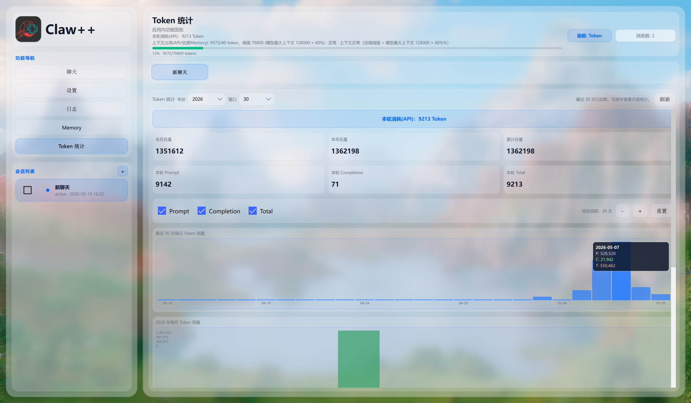

<p align="center">
  <a href="README.md"></a>
  <a href="README_EN.md"></a>
</p>

---

<p align="center">
  
</p>

<h1 align="center">Claw++ — AI Agent Desktop Application</h1>

<p align="center">
  <a href="https://github.com/DavidLi-TJ/ClawPP-Agent/stargazers">
    
  </a>
  <a href="https://github.com/DavidLi-TJ/ClawPP-Agent/network/members">
    
  </a>
  <a href="https://github.com/DavidLi-TJ/ClawPP-Agent/issues">
    
  </a>
  <a href="https://github.com/DavidLi-TJ/ClawPP-Agent/blob/main/LICENSE">
    
  </a>
</p>

<p align="center">
  
  
  
  
</p>

---

## Introduction

> **Claw++** is a modern AI Agent desktop application built with Qt/C++ for the Windows platform. It implements a complete ReAct (Reasoning + Acting) loop, supports **23 LLM service providers** (covering OpenAI, Anthropic, Gemini, DeepSeek, Zhipu and other mainstream platforms), and provides rich tool calling capabilities with intelligent memory management. Built with Qt Quick 6, it features a stunning Windows 11 glass morphism UI with real-time streaming chat, session management, context compression, and a skill plugin system.

<details>
<summary>UI Preview</summary>



</details>

### Key Features

- **ReAct Engine**: Think-Act-Observe loop with multi-turn autonomous reasoning
- **9 Built-in Tools**: file read/write, shell commands, network requests, subagents, search, etc.
- **Streaming Chat**: SSE-based real-time responses with Markdown rendering and code highlighting
- **3-Level Permission System**: Safe / Moderate / Dangerous with shell risk scoring (1-4)
- **4-Stage Memory Compression**: Trim → Dedupe → Fold → Summarize progressive pipeline
- **Skill Plugin System**: Markdown skill definitions with YAML metadata, hot-reload at runtime
- **Win11 Glass Morphism UI**: Frosted panels, liquid buttons, ripple effects, smooth animations
- ** Ultimate UI Customization**: Pick your own background, dial the blur to perfection, tweak line spacing, fine-tune corners and shadow depth. Every pixel, your call.
- **🪶 Feather-Light**: Native C++ compilation — installer under 100MB, minimal memory footprint. Say goodbye to bloated Electron apps.
- **23 LLM Providers**: Comprehensive coverage of domestic and international platforms
- **SQLite Persistence**: Full session, message, and memory storage with import/export

### Why Claw++?

> Tired of AI chat apps that hog hundreds of MBs and eat all your RAM? Claw++ is compiled in native C++, ships in under 100MB, and runs buttery smooth.
>
> Sick of cookie-cutter interfaces? Claw++ puts you in the driver's seat. Swap in your own background image, dial the frosted glass blur to your liking, nudge the line spacing, even tweak corner radii and shadow depth. Every detail bends to your taste.
>
> Beauty meets performance. Windows 11 glass morphism aesthetics, liquid buttons, and ripple effects — gorgeous without bogging down your machine.

### Supported Model Providers

| Category | Provider |
|----------|----------|
| **Global** | OpenAI |
| | Anthropic |
| | Google Gemini |
| | Mistral AI |
| | Groq |
| | OpenRouter |
| | GitHub Copilot |
| | Azure OpenAI |
| | OpenAI Codex |
| **China** | DeepSeek |
| | Zhipu AI |
| | Z.ai |
| | Moonshot AI |
| | DashScope |
| | SiliconFlow |
| | StepFun |
| | MiniMax |
| | Volcengine |
| | BytePlus |
| | AI Hub Mix |
| **Local** | Ollama |
| | OpenVINO |
| | vLLM |

---

## Screenshots

> Screenshots will be added here.

---

## 📦 Installation

###  Download Installer (Recommended)

Get the latest Windows installer (.exe) from [GitHub Releases](https://github.com/DavidLi-TJ/ClawPP-Agent/releases). Double-click to install — zero config needed.

> 💡 Installer under 100MB, one-click install, ready to use out of the box
>
> 📦 Installer file: `ClawPP-Installer-v1.0.0.exe` (57.7 MB)

### 🔄 Build Installer with IFW

> Requires [Qt Installer Framework](https://doc.qt.io/qtinstallerframework/) to be installed first

```bash
# Run from project root
build_installer.bat
```

The script handles everything: Release build → gather files → IFW packaging → generates `ClawPP-Installer-v1.0.0.exe`.

### 🔨 Build from Source

#### Requirements

| Dependency | Version |
|------------|---------|
| Qt | 6.5+ |
| CMake | 3.20+ |
| C++ Compiler | MSVC 2019+ / GCC 8+ / Clang 9+ |

#### Build Steps

```bash
git clone https://github.com/DavidLi-TJ/ClawPP-Agent.git
cd ClawPP-Agent
mkdir build && cd build
cmake ..
cmake --build . --config Release
```

#### Build Installer

> Requires [Qt Installer Framework](https://doc.qt.io/qtinstallerframework/) to be installed first

```bash
# Run from project root
build_installer.bat
```

The script handles everything: Release build → gather files → IFW packaging → generates `ClawPP-Installer-v1.0.0.exe`.

### Run

```bash
# Windows
.\bin\ClawPP.exe

# Linux/Mac
./bin/ClawPP
```

---

## Project Structure

```
cpqclaw/
├── src/                    # C++ source code
│   ├── agent/              # Agent core (ReAct, context builder)
│   ├── application/        # Application layer (service, session)
│   ├── common/             # Types, constants
│   ├── infrastructure/     # Config, database, network, logging
│   ├── memory/             # Memory system
│   ├── permission/         # Permission management
│   ├── provider/           # LLM providers
│   ├── skill/              # Skill system
│   ├── tool/               # Tool system
│   └── ui/                 # Qt Widgets-based UI
├── qml/                    # QML UI files
├── resources/              # Resource files
├── CMakeLists.txt          # Build configuration
└── README.md               # Documentation (Chinese)
```

---

## License

MIT License - see [LICENSE](LICENSE) file for details.

---

<p align="center">
  Made with ❤️ by <a href="https://github.com/DavidLi-TJ">DavidLi-TJ</a> | NKU Course Project
</p>
